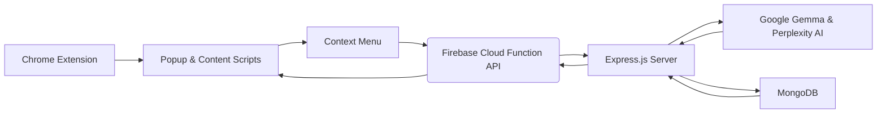

#  Ask‑My‑AI

[](https://github.com/ShobhitMaste/Ask-My-AI/stargazers)
[](https://github.com/ShobhitMaste/Ask-My-AI/network)
[](https://github.com/ShobhitMaste/Ask-My-AI/issues)

> **Ask‑My‑AI** is a powerful Chrome extension that brings AI-driven insights directly to your browser. Select text anywhere on the web, and receive concise, context-aware answers from Google Gemma or Perplexity AI.

---

## 🌟 Table of Contents

- [Features](#-features)
- [Screenshots](#-screenshots)
- [Tech Stack](#-tech-stack)
- [Architecture](#-architecture)
- [Installation](#-installation)
  - [Prerequisites](#prerequisites)
  - [Backend Setup](#backend-setup)
  - [Chrome Extension Setup](#chrome-extension-setup)
- [Configuration](#-configuration)
- [Usage](#-usage)
- [Contributing](#-contributing)
- [License](#-license)
- [Contact](#-contact)

---

## 🚀 Features

- **Dual AI Providers**: Seamlessly switch between **Google Gemma** and **Perplexity AI**.
- **Custom Context Menu**: Right-click selection invokes the “Ask My AI” option.
- **Secure Authentication**: User registration and login with **bcrypt** and **cookie-session**.
- **Cloud‑Hosted Backend**: Built on **Firebase Cloud Functions** for global accessibility.
- **Persistent Storage**: **MongoDB** database for user data and query history.
- **Lightweight Frontend**: Pure **HTML**, **CSS**, and **JavaScript** for smooth performance.

---

## 📸 Screenshots

| Login & Sign‑In | Ask Query |
| :-: | :-: |
|  |  |

| Choose AI Option | Context Menu |
| :-: | :-: |
|  |  |

---

## 🛠 Tech Stack

- **Frontend**: HTML5, CSS3, Vanilla JavaScript (Chrome Extension)
- **Backend**: Node.js, Express.js, Firebase Cloud Functions
- **Database**: MongoDB (Mongoose)
- **Authentication**: bcrypt, cookie-session
- **AI Services**: Google Gemma, Perplexity AI
- **Deployment**: Firebase, GitHub

---

## 🏗 Architecture



---

## 📥 Installation

### Prerequisites

- Node.js (v14+)
- npm or yarn
- MongoDB instance (local or cloud)
- Firebase account with Cloud Functions enabled

### Backend Setup

1. **Clone the repo**

   ```bash
   git clone https://github.com/ShobhitMaste/Ask-My-AI.git
   cd Ask-My-AI
   ```

2. **Install dependencies**

   ```bash
   npm install
   ```

3. **Configure environment variables**

   Create a `.env` file in the root:
   ```env
   API_KEY=YOUR_PERPLEXITY_API_KEY
   API_GOOGLE=YOUR_GOOGLE_API_KEY
   MONGODB=YOUR_MONGODB_CONNECTION_STRING
   LOCALPORT=3000
   ```

4. **Deploy to Firebase**

   ```bash
   firebase deploy --only functions
   ```

5. **Or run locally**

   ```bash
   npm start
   ```

### Chrome Extension Setup

1. **Load Extension in Chrome**

   - Navigate to `chrome://extensions/`
   - Enable **Developer mode**
   - Click **Load unpacked** and select the `Extension` directory

2. **Verify Backend URL**

   Update the `link` constant in `popup.js` and `context_menu.js` to point to your deployed or local API.

---

## ⚙️ Configuration

- **AI Provider**: In the extension popup, click the gear icon and select **Google AI** or **Perplexity AI**.
- **Session Duration**: Default cookie-session duration is 2 hours (configurable in `index.js`).

---

## 💡 Usage

1. **Open the extension** and log in or register.
2. **Select text** on any webpage.
3. **Right-click** and choose **Ask My AI**.
4. **Receive** a concise AI-generated answer via browser alert.

---

## 🤝 Contributing

Contributions are welcome! Please follow these steps:

1. Fork the repository.
2. Create a new branch: `git checkout -b feature/YourFeature`.
3. Commit your changes: `git commit -m 'Add YourFeature'`.
4. Push to the branch: `git push origin feature/YourFeature`.
5. Open a pull request.

---

## 📬 Contact

**Shobhit Maste**  
- GitHub: [ShobhitMaste](https://github.com/ShobhitMaste)  
- Email: shobhitandansh@gmail.com  
